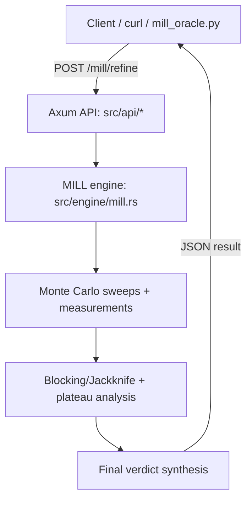

# HK-Core: Architecture Map & Status

> **Status:** `master` is the canonical 2D U(1) release line (CI + reproducible validation).  
> **Branches:** `master` (stable), `su2-3d` (active research), `transition-legacy-3d` (archived transition).

## Scope (what this repo is)
HK-Core is an autonomous “instrument” that runs a lattice toy model (MILL) and produces auditable JSON telemetry plus an explicit decision report.

In `master`, the physics kernel is **2D U(1)**. Other branches extend dimension / gauge group but keep the same API + JSON contract.

## Canonical pipelines (do not mix outputs)
| Block | Canonical entrypoint | Inputs | Outputs | Notes |
|---|---|---|---|---|
| **HTTP server** | `cargo run --release` | `AUTH_TOKEN`, optional `RUST_LOG` | Listens on `:8080` | Source of truth for `/mill/refine`. |
| **Single refine run** | `POST /mill/refine` | JSON payload (see `README.md`) | JSON response | Do not “massage” results; store the full JSON. |
| **Oracle loop** | `python3 mill_oracle.py --output out/<file>.json` | URL + token + base params | `out/*.json` | Repeats `/mill/refine`, doubling `n_sweeps` until decisive or max rounds. |
| **Canonical artifacts** | GitHub Releases | Selected JSON outputs + checksums | Release assets | `out/` is intentionally not committed. |

## Contract (frozen interfaces)
These should remain stable on `master`:
- Endpoint: `POST /mill/refine`
- Auth: `Authorization: Bearer <token>`
- JSON schema of the response (especially `result.final_verdict.*`)
- Default behavior when optional knobs are omitted

## Repository layout
- `src/api/` — Axum HTTP layer (`/mill/refine`, auth, types)
- `src/engine/mill.rs` — MILL kernel + measurement + analysis + verdict synthesis
- `mill_oracle.py` — external orchestration loop (calls `/mill/refine`)
- `.github/workflows/rust.yml` — CI build + test
- `out/` — local experiment outputs (gitignored)
- `target/` — Cargo build artifacts (gitignored)

## Data policy
- `target/` is never committed.
- `out/` is never committed; treat it as scratch space.
- Publish “canonical” outputs as Release assets (plus hashes) when needed for audit.

## Milestones (max achieved)
### 2D U(1) baseline (master)
- IR-Lmax stat threshold check validated at `Lmax=64` for `m0=0.1` (see: `results/2d_u1/beta2_seed777_s60000_stat_ir_lmax.json`).

### 3D references (research lines)
- 3D U(1) dim check sample (see: `results/3d_u1/demo_3d_u1_run_L16.json`).
- 3D SU(2) current max IR reached in saved runs: `Lmax=32`, best observed `ir_lmax.plateau_width=5` (see: `results/3d_su2/ic_test_A_hot_seed777_ls16-32_b1p6_s0p06_th2000_sw8000_me10_stat_ir_lmax.json`).
- IC coupling instrumentation exists only in `su2-3d` and is documented under `results/README.md`.

## Runtime architecture (high level)

## Branch strategy
| Branch | Status | Purpose |
|---|---|---|
| `master` | stable | Canonical 2D U(1) instrument + CI + reproducible validation. |
| `su2-3d` | active | Research line for SU(2) 3D; must be treated as experimental. |
| `transition-legacy-3d` | legacy | Historical U(1) 3D transition branch (archived). |
